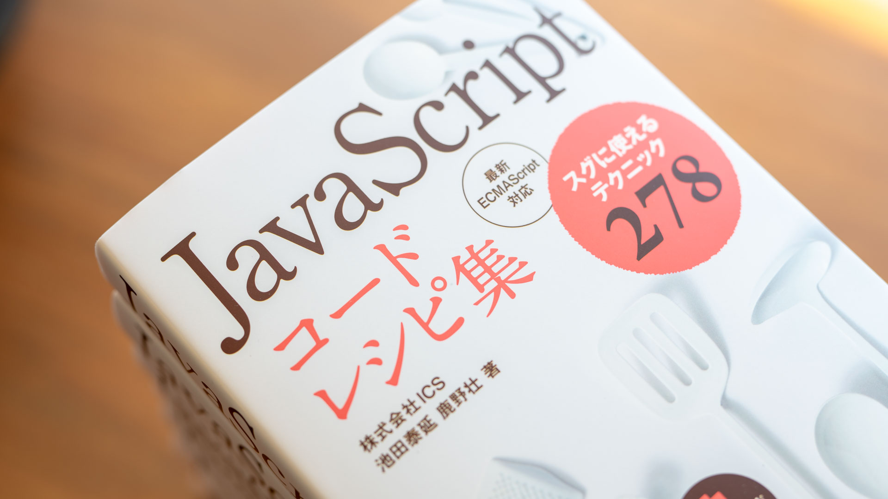
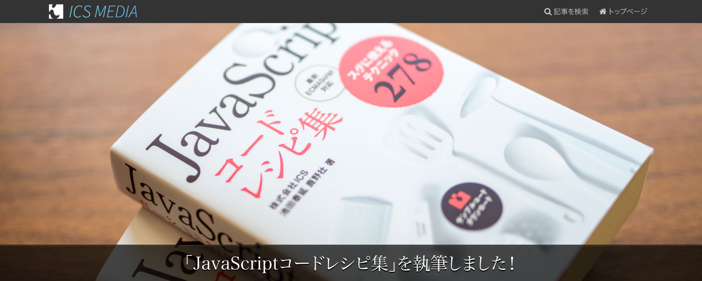

# 「JavaScript コードレシピ集（技術評論社）」のサンプルファイルと補足



この度は「[JavaScript コードレシピ集](https://gihyo.jp/book/2019/978-4-297-10368-2)」をご購入いただき、ありがとうございます。こちらではサポートページの一部としてサンプルコードの公開と補足をしています。

**⭐ サンプルコードや説明は定期的に更新されています。学習の際は常に最新のものをご利用ください ⭐**

## ダウンロード
サンプルファイルを一括でダウンロードする場合は次のURLを参照してください。

https://github.com/ics-creative/js-code-recipe/archive/master.zip

## フォルダー構成

サンプルファイルは各章・各項目のフォルダーにわけて収録しています。

```
js-code-recipe
　└ samples
　　　├ c01
　　　│　├ 002
　　　│　├ 003
　　　│　├ 004
　　　（中略）
　　　│　└ 016
　　　├ c02
　　　│　├ 002
　　　│　├ 022
　　　（中略）
　　　└ c19
　　　（中略）
```

たとえば、2章031「文字列を取り出したい」のサンプルは`samples/c02/031`フォルダーに格納されています。

## ローカルで動作しないサンプル用のURL

次のサンプルはローカルで実行すると動作しません。確認可能なURLがありますのであわせて参照ください。

| 章フォルダー | 項目番号 | 項目名                                      | 確認可能なURL                                                                                   |
|:-----------|:--------|:-------------------------------------------|:----------------------------------------------------------------------------------------------|
| c11        | 200     | 音声を読み込みたい                            | [サーバー上で確認する](https://ics-creative.github.io/js-code-recipe/samples/c11/200/index.html) |
| c12        | 214     | 画像のRGBA値を調べたい                        | [サーバー上で確認する](https://ics-creative.github.io/js-code-recipe/samples/c12/214/index.html) |
| c12        | 215     | キャンバスの画像を加工したい                    | [サーバー上で確認する](https://ics-creative.github.io/js-code-recipe/samples/c12/215/index.html) |
| c12        | 218     | キャンバスで描いたグラフィックをダウンロードしたい | [サーバー上で確認する](https://ics-creative.github.io/js-code-recipe/samples/c12/218/index.html) |

自身で変更したサンプルを確認するにはサーバーが必要です。Google Chromeの拡張機能「[Web Server for Chrome](https://chrome.google.com/webstore/detail/web-server-for-chrome/ofhbbkphhbklhfoeikjpcbhemlocgigb)」を使うと、手軽に構築できます。

- 参考：[Web Server for Chromeの設定方法](https://twitter.com/tonkotsuboy_com/status/868397954532495360)

## スマートフォン用サンプルの確認方法

次のサンプルはスマートフォン用のものです。スマートフォンで確認しやすいよう、URLを準備しましたのであわせて参照ください。

| 章フォルダー | 項目番号 | 項目名                                   | 確認可能なURL                                                                                   |
|:-----------|:--------|:--------------------------------------|:----------------------------------------------------------------------------------------------|
| c07        | 125     | タッチ操作時に処理をしたい                | [サーバー上で確認する](https://ics-creative.github.io/js-code-recipe/samples/c07/125/index.html) |
| c07        | 126     | タッチ操作時のイベントの発生情報を取得したい | [サーバー上で確認する](https://ics-creative.github.io/js-code-recipe/samples/c07/126/index.html) |


## Internet Explorer 11の対応方法
本書のサンプルコードをInternet Explorer 11（以下、IE11）で動作させるための手順については、次のURLを参照してください。

https://github.com/ics-creative/js-code-recipe-ie11/

※ IE11向けに動作するためのビルド設定が入っています。通常のサンプルより複雑な構成なので、学習目的としては通常のサンプルをご使用ください。

## 本書に対する思い・こだわり

「[『JavaScriptコードレシピ集』を執筆しました！ - ICS MEDIA](https://ics.media/entry/19765)」にて公開中ですのでぜひご覧ください。

[](https://ics.media/entry/19765)

## 著者

株式会社ICSの2人が書籍の執筆、サンプルの作成を行いました。

- [池田 泰延](https://twitter.com/clockmaker)
- [鹿野壮](https://twitter.com/tonkotsuboy_com)

また、オウンドメデイア「[ICS MEDIA](https://ics.media/)」で毎週ウェブ制作の記事を公開しています。こちらもあわせてチェックすると、よりウェブ制作の知識が高まるでしょう。

[](https://ics.media/)

## 免責事項
サンプルファイルについて、一般的な環境においてはとくに問題のないことを確認しておりますが、万一障害が発生しその結果いかなる障害が生じたとしても、小社および著者はなんら責任を負うものではありません。また生じた障害に対する一切の保証をいたしかねます。必ずご自身の判断と責任においてご利用ください。

## 著作権
サンプルファイルは著作権法上の保護を受けています。収録されているファイルの一部、あるいは全部について、いかなる方法においても無断で複写・複製・再配布することは禁じられています。

